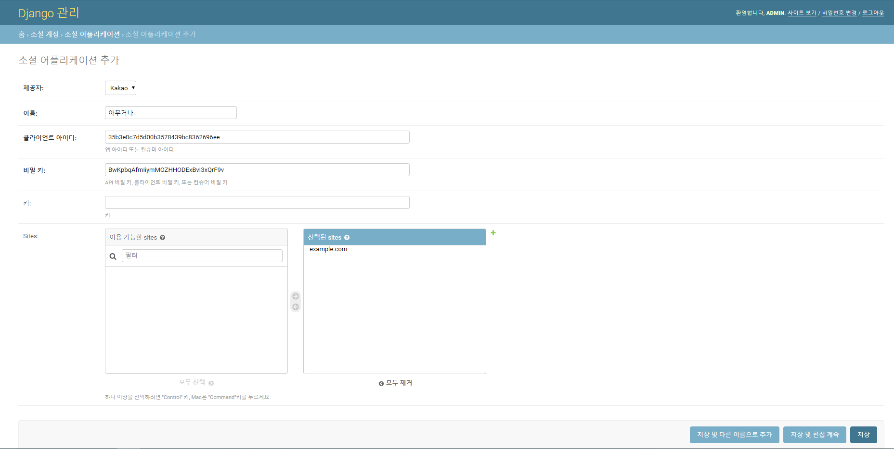

oauth

소셜 로그인

auth

- authentication
- authorization


날짜를 가지고 와서 입력값이랑 비교하고

같으면 저장 아니면 리턴

같은데 영화가 있으면 리턴(기존)

-> 


```
1. 사용자가 카카오링크(/accounts/kakao/login/)
2. 사용자는 카카오 사이트 로그인 페이지를 확인
3. 사용자는 로그인 정보를 카카오로 보냄
4. 카카오는 redirect url로 django 서버로 사용자 토큰을 보냄
5. 해당 토큰을 이용하여 카카오에 인증 요청
6. 카카오에서 확인
7. 로그인
--------------------------------------------------------
* 토큰(access token)은 보통 유효기간이 있는데,
* refresh token을 통해서 토큰 재발급을 받을 수 있다.
```

```
카카오 - 리소스 서버/인증 서버
사용자(리소스 owner) - 유저
django - 클라이언트
```



